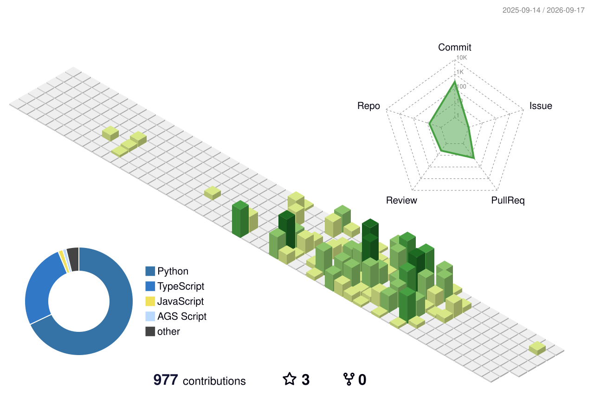

I enjoy building AI systems that actually solve problems — fraud detection, compliance automation, and multi-agent architectures that make decisions at scale.

Got an idea that will probably fail but sounds fun? Let's talk.

  

